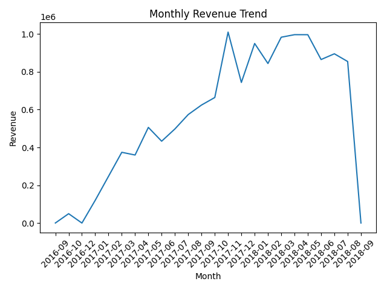
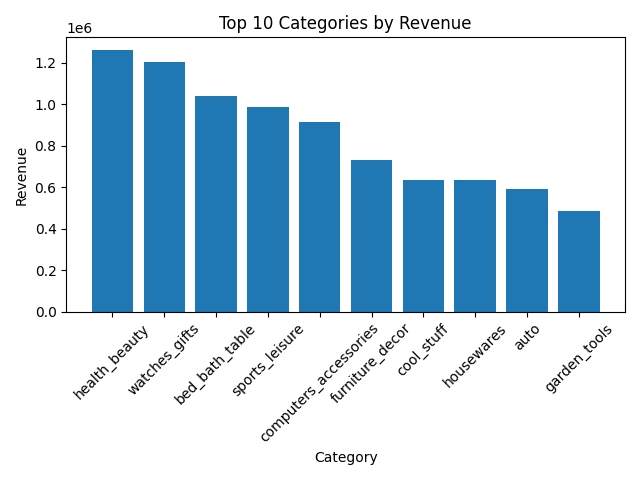
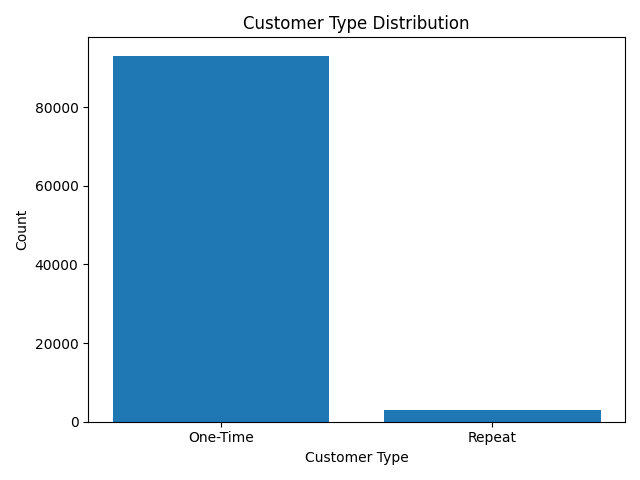

# E-commerce Customer Intelligence & Revenue Optimization

## 📌 Project Overview

This project analyzes an e-commerce dataset to evaluate business performance, customer behavior, and product category trends. The objective is to generate actionable insights that can help improve revenue growth and customer retention.

---

## 🎯 Business Problem

The business aims to answer key questions:

* How is revenue trending over time?
* Which product categories drive the highest revenue?
* What is the customer retention pattern?
* Where are the opportunities to improve business performance?

---

## 🛠️ Tools & Technologies

* **SQL (MySQL)** — Data cleaning, transformation, and KPI analysis
* **Python (Pandas, Matplotlib)** — Data analysis and visualization
* **Power BI** — Interactive dashboard creation
* **GitHub** — Project documentation and version control

---

## 📊 Dataset

**Olist Brazilian E-commerce Dataset**

### Key Tables:

* Customers
* Orders
* Order Items
* Products
* Payments
* Category Translation

---

## ⚙️ Project Workflow

1. Designed structured project architecture
2. Imported and transformed raw CSV data into MySQL
3. Performed data validation and integrity checks
4. Calculated business KPIs using SQL
5. Conducted customer behavior analysis
6. Identified top-performing product categories
7. Built visualizations using Python
8. Developed an interactive Power BI dashboard

---

## 📈 Key KPIs

* **Total Revenue:** $13.6M
* **Total Orders:** 99,441
* **Total Customers:** 96,096
* **Average Order Value (AOV):** $137.7

---

## 🔍 Key Insights

* The business generated **$13.6M revenue from ~99K orders**
* Customer retention is significantly low:

  * **93,099 one-time customers (~97%)**
  * **2,997 repeat customers (~3%)**
* Repeat customers, although fewer, contribute higher value per customer
* Top revenue-driving categories:

  * Health & Beauty
  * Watches & Gifts
  * Bed, Bath & Table
* Revenue trend shows strong growth initially, with a decline in later periods likely due to incomplete recent data

---

## 💡 Business Recommendations

* Implement loyalty programs to improve customer retention
* Target one-time buyers with personalized remarketing campaigns
* Focus marketing spend on high-performing categories
* Increase average order value using bundles and cross-selling strategies
* Monitor repeat customer behavior as a key growth driver

---

## 📊 Python Visualizations

### Monthly Revenue Trend



### Top Categories by Revenue



### Customer Distribution



---

## 📊 Power BI Dashboard

An interactive dashboard was developed to visualize:

* Key KPIs (Revenue, Orders, Customers, AOV)
* Monthly revenue trends
* Top product categories
* Customer behavior insights

📁 File: `dashboard/dashboard.pbix`

---

## 📁 Project Structure

```
ecommerce-customer-intelligence/
│
├── data/
├── sql/
├── python/
│   └── ecommerce_analysis.py
├── dashboard/
│   └── dashboard.pbix
├── visuals/
├── README.md
```

---

## 🚀 Future Improvements

* Customer segmentation using RFM analysis
* Cohort-based retention analysis
* Predictive modeling for customer churn
* Advanced dashboard interactivity

---

## 👨‍💻 Author

**Mohammad Reyaz Shaik**
